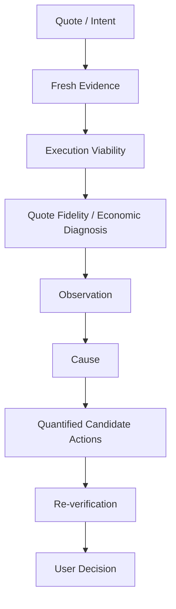
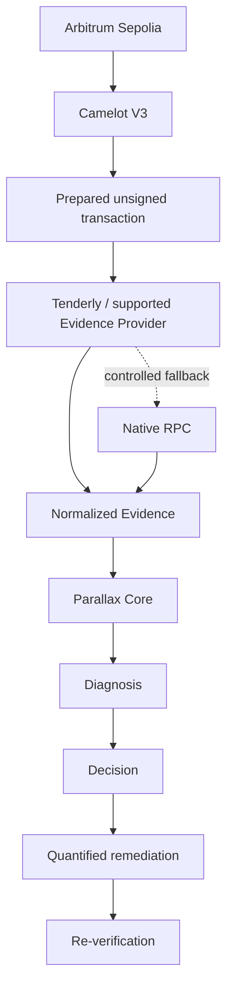

<div align="center">

<p>
  <a href="./README.md">English</a> |
  <a href="./README.zh-CN.md">简体中文</a>
</p>

# Parallax

### Pre-execution diagnosis, remediation, and re-verification for onchain actions

**Know what changed. Understand why. See what you can change. Verify before you sign.**

[Live Demo](https://parallax-web-snowy.vercel.app) ·
[Product Spec](docs/product/p0-economic-diagnosis-remediation.md) ·
[Documentation](docs/README.md) ·
[Demo Video](https://www.youtube.com/watch?v=j43WqH6TrTE)

</div>

Parallax is a provider-agnostic pre-execution remediation and re-verification layer for onchain actions. The public demo currently uses the Monad × Kuru × Moss path.

## Why Parallax?

A quote can change before a user signs. A transaction can still execute while no longer reproducing the economic outcome the user selected. A simulation may expose the result but still leave the user asking: “What changed, why, and what should I change?”

Parallax closes that decision gap by turning heterogeneous Evidence into a bounded diagnosis, quantified candidate actions, and a state-bound re-verification step.

## Product loop

The user-facing interpretation is:



The underlying Core relationship remains:

```text
Intent → Evidence → Cause → Decision → Relevant Action → Re-verification
```

`UNKNOWN` is not a pass. `PROCEED` means that no blocking evidence was found within the checked scope; it is not a safety guarantee or investment advice.

## Demo

- [Try the live application](https://parallax-web-snowy.vercel.app)
- [View the Demo Day presentation](https://parallax-monad.github.io/parallax/parallax-demo-day.html)
- [Watch the product demo video](https://www.youtube.com/watch?v=j43WqH6TrTE)

The landing page is served at `#/`, and the wallet-style MVP is at `#/analyze`.

1. Enter a supported Swap Intent.
2. Request a quote and run the pre-sign check.
3. Review Evidence, provenance, scope, Cause, and Decision.
4. When the result supports it, change one relevant condition and run again.
5. Compare the Previous Run with the New Run.

The demo is read-only. It does not sign, broadcast, execute, or custody the user's transaction. Its verified live scope is limited to the documented pinned Kuru MON → USDC path and runtime identity; this does not establish support for every asset, route, protocol, runtime revision, or future market condition.

## What Parallax does

- accepts a structured, unsigned Swap Intent;
- obtains and normalizes quote, prepared-action, simulation, and provenance Evidence;
- evaluates deterministic rules while keeping Integration Error separate from transaction uncertainty;
- presents `PROCEED`, `ADJUST`, `STOP`, or `UNKNOWN` with checked, not-checked, and unknown scope;
- separates verified Relevant Actions from changes that the result does not support;
- supports recorded Replay and a bounded one-condition Re-run comparison.

## Target P0 Architecture

The following is a target reference model, not a claim that the complete path is implemented or deployed:



The intended decomposition is `Chain × Protocol × Evidence Provider`. It keeps Provider-specific types outside the Core and separates Evidence acquisition from Product/Risk decision semantics.

## Product principles

- Do not guess intent; use explicit objectives and thresholds when the caller provides them.
- Diagnose the observed gap and explain the Cause in plain language.
- Expose controllable variables and quantify candidate changes.
- When intent is not explicit, show multiple plausible, verified counterfactual options rather than silently choosing one.
- Verify recommendations against fresh quote, prepared unsigned transaction, simulation, and outcome Evidence.
- Treat verification as state-bound: a changed chain state requires a new check.
- Keep the final decision with the user.

The beginner experience does not require explicit thresholds: Parallax can present several verified counterfactual options. Advanced DeFi users, developers, SDKs, and agents can supply constraints such as price impact, effective rate, gas, total cost, or target output and use the same diagnosis → quantitative remediation → re-verification model.

## Boundaries

Parallax is not:

- a best-price aggregator or whole-market route optimizer;
- an autonomous execution engine;
- a wallet, custody system, signing or broadcasting service;
- a complete protocol, token, or smart-contract security audit;
- investment advice.

An explicitly evaluated alternative path can be shown when the available Evidence supports it. Whole-market optimization is outside P0.

## Architecture and technology stack

| Area | Responsibility |
| --- | --- |
| `apps/web` | React 18 + Vite frontend, landing experience, wallet-style MVP, API adapter, and Three.js visualization |
| `apps/api` | Node.js/Hono HTTP runtime for quote/check and recorded Replay |
| `packages/contracts` | Shared Intent, Run, Evidence, Replay, serialization, and compatibility schemas |
| `packages/moss-bridge` | Moss/Kuru runtime loading, live Evidence adapter, normalization, and provenance checks |
| `packages/orchestrator` | Agent Flow, Action Gate, Re-run lifecycle, and application orchestration |
| `packages/risk` | Deterministic P0 rule evaluation and centralized Decision policy |
| `fixtures` | Recorded raw/normalized Evidence and Replay fixtures |
| `docs` | Product, research, planning, integration, methodology, and ADR references |
| `scripts` | Deterministic and live Kuru smoke/acceptance tooling |

The toolchain is Node.js 22, pnpm, TypeScript, React, Vite, Three.js, Hono, Vitest, and Biome.

## Repository structure

```text
apps/                  Runtime applications
packages/              Shared Core packages
docs/                  Product, research, planning, integration, methodology, ADRs
fixtures/              Recorded Evidence and Replay fixtures
scripts/               Validation and smoke tooling
```

## Installation and local development

Requirements: Node.js 22, pnpm 11-compatible tooling, and Git.

```bash
pnpm install --frozen-lockfile
cp .env.example .env
pnpm --filter @parallax/web dev
```

Use `#/` for the landing page and `#/analyze` for the MVP. To run local quote/check requests, configure `.env` and start the API in another terminal:

```bash
pnpm --filter @parallax/api start
```

The local Vite server proxies `/api/*` to `http://127.0.0.1:8787`.

<details>
<summary>Environment configuration</summary>

`.env.example` is the authoritative variable list.

| Variable | Purpose |
| --- | --- |
| `MONAD_RPC_URL` | Read-only Monad RPC for backend live quote/check requests |
| `MOSS_RPC_URL` | Read-only RPC for the live smoke command |
| `MOSS_RUNTIME_VERSION` | Expected Moss runtime version |
| `MOSS_RUNTIME_REVISION` | Expected immutable Moss Git revision |
| `MOSS_RUNTIME_PATH` | Absolute path to the built, pinned Moss checkout; enables the live Kuru Agent Flow |
| `PARALLAX_TOKEN_REGISTRY_JSON` | Trusted token metadata for backend normalization |
| `CORS_ORIGIN` | Browser origin allowed to call the API |
| `RUN_STORE_BACKEND` | `memory` by default; use `postgres` only after migration and verification |
| `DATABASE_URL` | PostgreSQL URL required when `RUN_STORE_BACKEND=postgres` |
| `HOST` / `PORT` | Node HTTP listener settings |

Live Moss operation requires `MOSS_RUNTIME_PATH` to retain `.git` metadata and match the configured version/revision. Without it, live quote/check requests fail closed as `UNSUPPORTED`; recorded Replay remains separate.

Never commit RPC credentials or populated `.env` files.

</details>

## Development commands

```bash
pnpm lint
pnpm typecheck
pnpm test
pnpm test:acceptance
pnpm test:integration
pnpm --filter @parallax/web build
pnpm smoke:kuru
pnpm smoke:kuru:live
```

The live smoke requires the pinned Moss runtime and read-only RPC configuration and is not part of the default CI path.

## Testing and quality gates

GitHub Actions uses Node.js 22 and runs dependency installation, lint, typecheck, deterministic tests, and Node integration tests. Live RPC/Moss smoke tests remain separate because they require external runtime configuration.

## API overview

| Route | Purpose |
| --- | --- |
| `POST /api/quote` | Exact-input live quote boundary; returns a quote, an explicit unavailable/no-route result, or a scoped error. |
| `POST /api/check` | Backend pre-sign check for a normalized Swap Intent; Re-run uses `parentRunId` and one allowed Intent change. |
| `GET /api/runs/:runId` | Retrieves one persisted Check Run by ID. |
| `GET /api/replay/:id` | Retrieves a frozen recorded Replay fixture, never substituted for a live Check. |

See the [frontend API handoff](docs/integration/api-frontend-handoff.md) for payloads, errors, CORS, and startup details.

## Deployment

The public frontend is deployed on Vercel with a same-origin `/api/*` rewrite to the deployed Render backend. Availability depends on the external backend, RPC, and pinned Moss runtime; this is not a production-readiness claim and does not expand the verified protocol scope.

## Documentation

Start with the [full documentation index](docs/README.md).

The primary Product references are:

- [P0 Economic Diagnosis & Remediation](docs/product/p0-economic-diagnosis-remediation.md)
- [Product Requirements Document](docs/product/prd.md)
- [Product Delivery](docs/product/product-delivery.md)

## Team

| Member | GitHub | Role |
| --- | --- | --- |
| Kai | [@chin0312](https://github.com/chin0312) | Product Owner |
| Rei | [@rainypilgrimage](https://github.com/rainypilgrimage) | Contract Owner |
| Jie | [@jzhao0](https://github.com/jzhao0) | Provider Owner |
| Clare | [@brightheartma](https://github.com/brightheartma) | Backend Owner |
| Antony | [@antony819](https://github.com/antony819) | Frontend Owner |

## Collaboration

- Start from the latest `main` on a short-lived branch.
- Keep implementation, Contract semantics, Product semantics, and Evidence claims in their owning layers.
- Treat research as context; implementation behavior is defined by code and merged product documentation.
- Do not use Replay or mock data as proof of a live user decision.
- Run relevant checks and request review from owners of the changed semantics.

## Disclaimer

Parallax is experimental software for explaining and testing bounded pre-execution decisions. Evidence may be incomplete or unavailable; users must independently verify transaction details. `UNKNOWN` is not a pass, and `PROCEED` is scope-bounded rather than a guarantee of safety.

Parallax does not provide investment advice and does not sign, broadcast, execute, or custody transactions.

## License

No repository license file is currently declared. Licensing remains a team decision.
