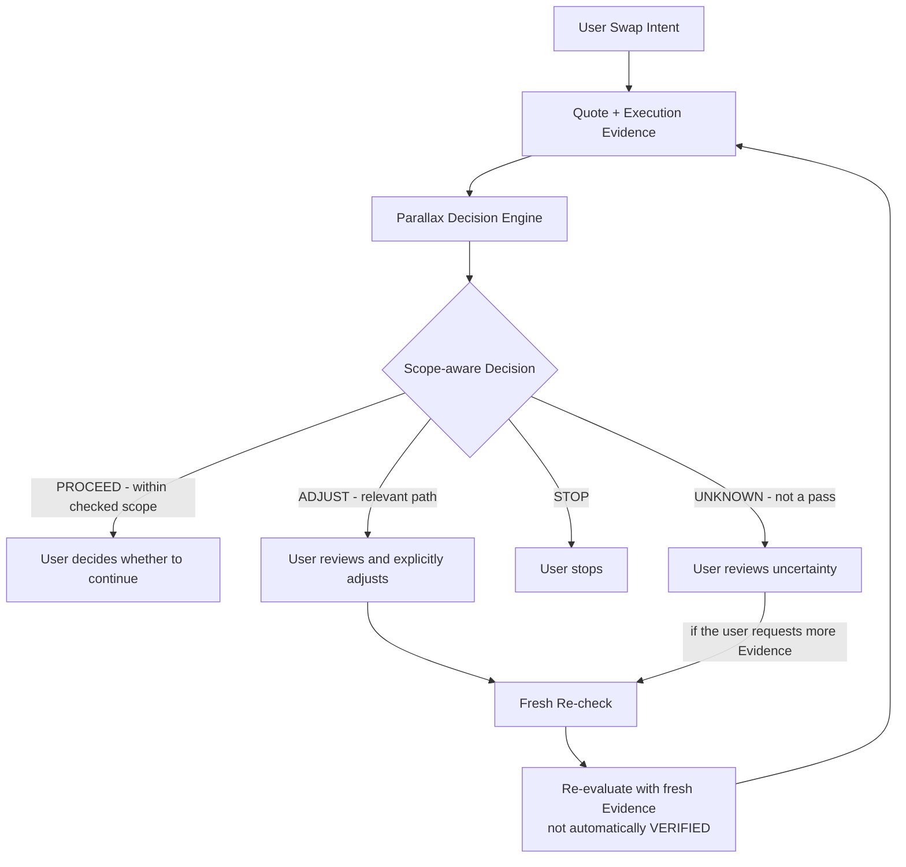
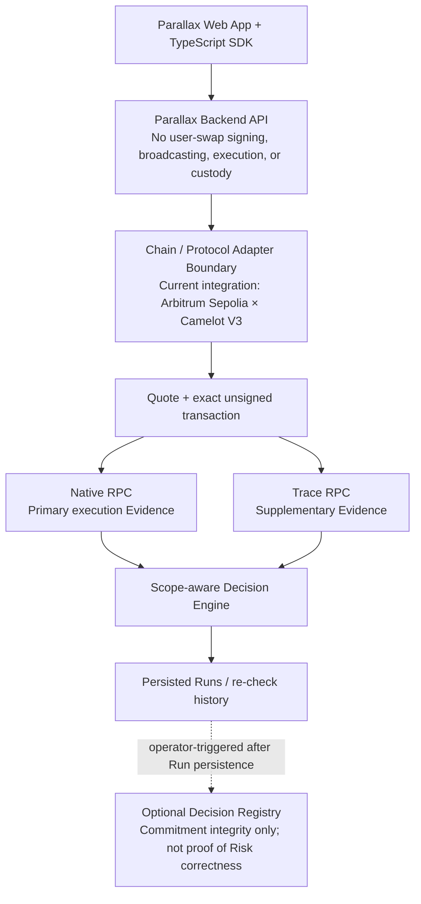

<div align="center">


# Parallax

### Before you sign, know what to do next.

A pre-execution decision layer for onchain transactions.

[Live Demo](https://parallax-web-snowy.vercel.app/) ·
[Pitch Deck](https://parallax-monad.github.io/parallax/parallax-demo-day.html) ·
[Demo Video](https://youtu.be/klOKwyWgiZU) ·
[Pitch Video](https://youtu.be/Dp_Ewlud5QU) ·
[Documentation](docs/README.md) ·
[GitHub](https://github.com/parallax-monad/parallax)

<sub>Currently implemented on Arbitrum Sepolia · Camelot V3 · TypeScript</sub>

<sub>English · <a href="./README.zh-CN.md">简体中文</a></sub>

</div>

## Why Parallax?

DEXs and aggregators provide quotes and routes. Wallets and security products provide
previews, warnings, and transaction context. Simulation tools expose execution behavior.
Those are valuable inputs, but a user can still be left to connect the evidence to their
own intended outcome.

A transaction may execute successfully while no longer producing the result the user
expected. When a check fails or is uncertain, it can also be hard to know which change
is relevant. Parallax focuses on that decision gap: making the available evidence,
checked scope, and possible next step understandable, then allowing the user to re-check
after an explicit change.

## What Parallax does

- Checks a quoted, prepared unsigned transaction against available execution Evidence.
- Presents scope-aware outcomes: `PROCEED`, `ADJUST`, `STOP`, or `UNKNOWN`.
- Separates observed conditions, supported Causes, Evidence State, and explicit user
  constraints instead of turning missing data into a confident answer.
- Keeps the decision with the user: Parallax does not sign or submit a swap.
- Persists Runs so a user can retrieve a prior result and compare an explicit re-check.

`PROCEED` means no blocking Evidence was found within the checked scope. It does not
guarantee safety or successful execution. `UNKNOWN` is not a pass. A proposed change is
not a verified improvement until a fresh child check supports that conclusion.

## How it works


```mermaid
flowchart TD
    I["User Swap Intent"] --> E["Quote + Execution Evidence"]
    E --> P["Parallax Decision Engine"]
    P --> D{"Scope-aware Decision"}
    D -->|PROCEED - within checked scope| C["User decides whether to continue"]
    D -->|ADJUST - relevant path| A["User reviews and explicitly adjusts"]
    D -->|STOP| S["User stops"]
    D -->|UNKNOWN - not a pass| U["User reviews uncertainty"]
    A --> R["Fresh Re-check"]
    U -->|if the user requests more Evidence| R
    R --> V["Re-evaluate with fresh Evidence<br/>not automatically VERIFIED"]
    V --> E
```

## Built on Arbitrum

The current real testnet path is Arbitrum Sepolia (`421614`) with Camelot V3. It
supports real testnet quotes, exact unsigned transaction preparation, and a primary
Native RPC execution-evidence path. Trace RPC supplies supplementary, deeper Evidence;
it does not replace the Native RPC baseline or upgrade a Risk verdict by itself.

Results disclose what was checked, what remains unknown or unavailable, and the
associated source and chain-state context. Sepolia token balances and prices are testnet
data and should not be treated as representative of Arbitrum One market prices. This
project does not claim Arbitrum One production support.

## Optional on-chain Decision Registry

Parallax has deployed an optional Decision Registry on Arbitrum Sepolia:

- Contract: [`0xdfc1f61e75fd551b9c309ec0bfae015adf6fe359`](https://sepolia.arbiscan.io/address/0xdfc1f61e75fd551b9c309ec0bfae015adf6fe359)
- [Deployment transaction](https://sepolia.arbiscan.io/tx/0x46cd3fd97086a40c157be0cdc50baa9a40db9c24417d723cc5dd6f08e6e000f6)
- [Decision attestation transaction](https://sepolia.arbiscan.io/tx/0x3e40db4fdc33b8bf3b726fa7f8a60049e0518c19e6cbc98eb69c20932f374af0)

An operator can use the Backend CLI to anchor a commitment for an already completed,
persisted Run. This is optional and non-blocking; it is not automatically triggered by
every `/api/check`. A designated operator-controlled attestor submits the Registry
transaction, so users do not connect a wallet or sign an attestation. The attestor signs
Registry transactions only, never user swaps.

The Registry stores a domain-separated Run key and commitment with minimal event
metadata—not the full Run or its Evidence. A matching commitment lets someone with the
corresponding off-chain record verify record integrity. It does not prove that the
underlying Evidence is authentic, that the Risk assessment is correct, or that a swap is
safe. See the [Decision Registry guide](contracts/decision-registry/README.md) for the
verification and operational boundaries.

## Developer integration

The repository includes a typed TypeScript SDK and a public HTTP API. The SDK wraps
quote, check, Run retrieval, re-check, and account-state queries; it does not duplicate
Risk or Provider logic. The SDK is available in this repository; this README does not
claim an npm release.

- [SDK guide](packages/sdk/README.md)
- [API and Frontend integration reference](docs/integration/api-frontend-handoff.md)
- [Decision Registry guide](contracts/decision-registry/README.md)

The API and SDK provide a foundation for future embedded pre-sign workflows in wallets,
DEXs, aggregators, and DeFi applications. These are integration opportunities, not
existing third-party partnerships.

## Where Parallax can go next

1. **Broader coverage** — more assets, protocols, transaction types, and execution
   environments.
2. **Embedded distribution** — reusable API and SDK workflows for wallets, DEXs,
   aggregators, and developer applications, including potential B2B/API delivery.
3. **Agent-native workflows** — future MCP-compatible interfaces and machine-readable,
   scope-bounded decisions for AI-agent orchestration. No MCP service or autonomous
   transaction execution is claimed today.

## Getting started

Requirements: Node.js 22 and pnpm.

```bash
pnpm install --frozen-lockfile
cp .env.example .env
```

For the current Arbitrum Sepolia path, configure `ARBITRUM_RPC_URL` and
`PARALLAX_TOKEN_REGISTRY_JSON` with trusted Arbitrum token metadata. Keep credentials in
local environment configuration; never commit them.

The API bootstrap still validates a syntactically valid `MONAD_RPC_URL` and non-empty
`MOSS_RUNTIME_VERSION` / `MOSS_RUNTIME_REVISION` fields from its legacy shared
configuration, even when running the Arbitrum path. This configuration requirement does
not mean the current product path uses Monad, Kuru, or Moss. `MOSS_RUNTIME_PATH` is
optional and can remain unset; a Moss checkout is not required for Arbitrum. See
[`.env.example`](.env.example) for the distinction.

In separate terminals, start the API and web app:

```bash
pnpm --filter @parallax/api start
pnpm --filter @parallax/web dev
```

The Vite app proxies `/api/*` to the local API. See [`.env.example`](.env.example),
the [API integration reference](docs/integration/api-frontend-handoff.md), and the
[SDK guide](packages/sdk/README.md) for configuration and request details.

Useful checks:

```bash
pnpm lint
pnpm typecheck
pnpm test
pnpm --filter @parallax/web build
```

## Current Architecture

| Area | Responsibility |
| --- | --- |
| `apps/web` | Web experience and presentation of API results |
| `apps/api` | Quote, check, account-state, Run, and orchestration APIs |
| `packages/contracts` | Shared request, Evidence, Run, and response schemas |
| `packages/risk` | Deterministic Risk and Verdict evaluation |
| `packages/orchestrator` | Provider execution and Run / re-check orchestration |
| `packages/sdk` | Typed client for the public API |
| `contracts/decision-registry` | Optional on-chain Decision Registry |
| `fixtures` | Deterministic test data and retained Evidence captures |
| `docs` | Product, integration, research, and project-history references |


```mermaid
flowchart TD
    APP["Parallax Web App + TypeScript SDK"] --> API["Parallax Backend API<br/>No user-swap signing, broadcasting, execution, or custody"]
    API --> ADAPTER["Chain / Protocol Adapter Boundary<br/>Current integration: Arbitrum Sepolia × Camelot V3"]
    ADAPTER --> TX["Quote + exact unsigned transaction"]
    TX --> NATIVE["Native RPC<br/>Primary execution Evidence"]
    TX --> TRACE["Trace RPC<br/>Supplementary Evidence"]
    NATIVE --> ENGINE["Scope-aware Decision Engine"]
    TRACE --> ENGINE
    ENGINE --> RUNS["Persisted Runs / re-check history"]
    RUNS -. operator-triggered after Run persistence .-> REGISTRY["Optional Decision Registry<br/>Commitment integrity only; not proof of Risk correctness"]
```

## Team

| Member | GitHub | Focus |
| --- | --- | --- |
| Kai | [@chin0312](https://github.com/chin0312) | Product strategy, research, and product direction |
| Rei | [@rainypilgrimage](https://github.com/rainypilgrimage) | Core Contract definitions, Risk semantics, and decision rules |
| Jie | [@jzhao0](https://github.com/jzhao0) | Provider integration and execution Evidence |
| Clare | [@brightheartma](https://github.com/brightheartma) | Backend infrastructure, APIs, and persistence |
| Antony | [@antony819](https://github.com/antony819) | Frontend and user experience |

## Limitations

Parallax is experimental software, and the Arbitrum integration described here is
testnet-scoped. Evidence may be incomplete or unavailable; users should independently
review transaction details. Parallax is non-custodial and does not sign, broadcast, or
execute user swaps, provide investment advice, or replace an independent security
review.

## License

The repository has no declared license. Public visibility does not grant unrestricted
reuse; licensing remains a team decision.
