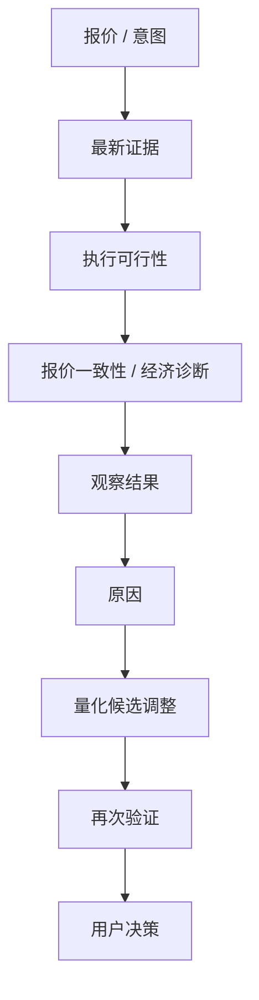
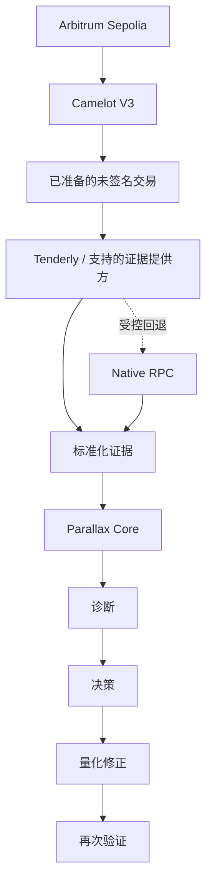

<div align="center">

# Parallax

### 面向链上操作的签名前诊断、修正与再次验证

**了解发生了什么。理解原因。明确可以修改什么。在签名前完成验证。**

[在线演示](https://parallax-web-snowy.vercel.app) ·
[产品规格](docs/product/p0-economic-diagnosis-remediation.md) ·
[文档索引](docs/README.md) ·
[演示视频](https://www.youtube.com/watch?v=j43WqH6TrTE)

<sub><a href="./README.md">English</a> · 简体中文</sub>

</div>

Parallax 是面向链上操作的、与 Provider 无关的签名前修正与再次验证层。当前公开演示使用 Monad × Kuru × Moss 路径。

## 为什么需要 Parallax？

报价可能在用户签名前发生变化。一笔交易仍可能成功执行，却不再复现用户选择的经济结果。模拟可以展示结果，但用户仍然会问：“发生了什么变化，原因是什么，我应该修改什么？”

Parallax 通过将异构证据转换为范围明确的诊断、量化的候选操作和与状态绑定的再次验证，来补上这段决策缺口。

## 产品流程

> **目标 P0 行为：** 下面的流程是 P0 的目标产品模型，不表示当前公开演示或 API 已支持这里描述的所有约束、候选求解或已验证反事实选项。当前支持范围仍限于文档所述的 Monad × Kuru × Moss 路径。

面向用户的解释流程如下：



底层 Core 关系保持为：

```text
意图 → 证据 → 原因 → 决策 → 相关操作 → 再次验证
```

`UNKNOWN` 不是通过。`PROCEED` 只表示在本次已检查范围内没有发现阻断证据；它不构成安全保证或投资建议。

## 项目演示

- [体验在线应用](https://parallax-web-snowy.vercel.app)
- [查看 Demo Day 演示文稿](https://parallax-monad.github.io/parallax/parallax-demo-day.html)
- [观看产品演示视频](https://www.youtube.com/watch?v=j43WqH6TrTE)

落地页位于 `#/`，钱包式 MVP 位于 `#/analyze`。

1. 输入受支持的 Swap 意图；
2. 请求报价并执行签名前检查；
3. 查看证据、溯源、检查范围、原因和决策；
4. 当结果支持时，修改一个相关条件并再次检查；
5. 比较上一次运行与新运行。

演示保持只读，不会签名、广播、执行或托管用户的交易。已核验的实时范围仅限文档所述的固定 Kuru MON → USDC 路径与运行环境；这不能证明所有资产、路径、协议、运行环境修订版或未来市场条件都受支持。

## Parallax 做什么

- 接收结构化、未签名的 Swap 意图；
- 获取并标准化报价、已准备操作、模拟结果和溯源证据；
- 执行确定性的规则，并将 Integration Error 与交易不确定性分开；
- 展示 `PROCEED`、`ADJUST`、`STOP` 或 `UNKNOWN`，同时披露已检查、未检查和未知范围；
- 将有证据支持的相关操作与本次结果不支持的修改分开；
- 支持记录回放，以及仅修改一个条件的受限再次检查对比。

## 目标 P0 架构

以下是目标参考模型，不代表整条路径已经实现或部署：



目标分解是 `Chain × Protocol × Evidence Provider`。它将 Provider 专属类型留在 Core 之外，并把证据获取与产品/风险决策语义分开。

## 产品原则

- 不猜测用户意图；调用方提供目标和阈值时才使用明确约束；
- 诊断实际差距，并用易懂的语言解释原因；
- 展示可控变量，并量化候选修改；
- 用户未明确表达意图时，展示多个可能的反事实选项及其验证状态，而不是静默替用户选择；
- 使用新的报价、已准备的未签名交易、模拟和结果证据验证建议；
- 验证与状态绑定：链上状态变化后必须重新检查；
- 最终决定权保留在用户手中。

在目标 P0 模型中，新手体验不要求提供明确阈值：Parallax 可以展示多个反事实选项，并明确区分已经重新验证的交易调整与仍需在条件满足后重新检查的条件性建议。高级 DeFi 用户、开发者、SDK 和 Agent 可以提供价格影响、有效汇率、Gas、总成本或目标输出等约束，并使用同一套“诊断 → 量化修正 → 再次验证”模型。这些属于目标语义，并不表示公开 API 当前已经支持每一种约束或求解器。

## 边界

Parallax 不是：

- 最优价格聚合器或全市场路径优化器；
- 自主执行引擎；
- 钱包、托管、签名或广播服务；
- 完整的协议、代币或智能合约安全审计；
- 投资建议服务。

当现有证据支持时，可以展示经过明确评估的替代路径。全市场优化不属于 P0 范围。

## 架构与技术栈

| 区域 | 职责 |
| --- | --- |
| `apps/web` | React 18 + Vite 前端、落地页、钱包式 MVP、API 适配层与 Three.js 可视化 |
| `apps/api` | 用于报价/检查和记录回放的 Node.js/Hono HTTP 运行环境 |
| `packages/contracts` | Intent、Run、Evidence、Replay、序列化与兼容性共享模式 |
| `packages/moss-bridge` | Moss/Kuru 运行环境加载、实时证据适配、标准化与溯源检查 |
| `packages/orchestrator` | Agent Flow、Action Gate、再次检查生命周期与应用编排 |
| `packages/risk` | 确定性的 P0 规则评估与集中式决策策略 |
| `fixtures` | 已记录的原始/标准化证据与记录回放样例 |
| `docs` | 产品、研究、计划、集成、方法论与 ADR 文档 |
| `scripts` | 确定性及实时 Kuru 冒烟/验收工具 |

当前工具链为 Node.js 22、pnpm、TypeScript、React、Vite、Three.js、Hono、Vitest 和 Biome。

## 仓库结构

```text
apps/                  运行时应用
packages/              共享 Core 模块
docs/                  产品、研究、计划、集成、方法论与 ADR
fixtures/              记录的证据与回放样例
scripts/               验证与冒烟工具
```

## 安装与本地开发

环境要求：Node.js 22、兼容 pnpm 11 的工具和 Git。

```bash
pnpm install --frozen-lockfile
cp .env.example .env
pnpm --filter @parallax/web dev
```

使用 `#/` 访问落地页，使用 `#/analyze` 访问 MVP。若要在本地运行报价/检查请求，请配置 `.env`，并在另一个终端启动 API：

```bash
pnpm --filter @parallax/api start
```

本地 Vite 服务器会把 `/api/*` 代理到 `http://127.0.0.1:8787`。

<details>
<summary>环境配置</summary>

`.env.example` 是环境变量的权威清单。

| 变量 | 用途 |
| --- | --- |
| `MONAD_RPC_URL` | 后端实时报价/检查使用的只读 Monad RPC |
| `MOSS_RPC_URL` | 实时冒烟命令使用的只读 RPC |
| `MOSS_RUNTIME_VERSION` | 预期的 Moss 运行环境版本 |
| `MOSS_RUNTIME_REVISION` | 预期的不可变 Moss Git 修订版 |
| `MOSS_RUNTIME_PATH` | 已构建、固定 Moss 检出目录的绝对路径，用于启用实时 Kuru Agent Flow |
| `PARALLAX_TOKEN_REGISTRY_JSON` | 后端标准化使用的可信代币元数据 |
| `CORS_ORIGIN` | 允许调用 API 的浏览器来源 |
| `RUN_STORE_BACKEND` | 默认 `memory`；完成迁移和验证后才使用 `postgres` |
| `DATABASE_URL` | `RUN_STORE_BACKEND=postgres` 时所需的 PostgreSQL URL |
| `HOST` / `PORT` | Node HTTP 监听配置 |

实时 Moss 运行要求 `MOSS_RUNTIME_PATH` 保留 `.git` 元数据，并与配置的版本/修订版匹配。缺少该路径时，实时报价/检查会以 `UNSUPPORTED` 明确关闭；记录回放仍是分开的路径。

请勿提交 RPC 凭据或已经填入真实值的 `.env` 文件。

</details>

## 开发命令

```bash
pnpm lint
pnpm typecheck
pnpm test
pnpm test:acceptance
pnpm test:integration
pnpm --filter @parallax/web build
pnpm smoke:kuru
pnpm smoke:kuru:live
```

实时冒烟需要固定 Moss 运行环境与只读 RPC 配置，不属于默认 CI 路径。

## 测试与质量门禁

GitHub Actions 使用 Node.js 22，执行依赖安装、lint、typecheck、确定性测试和 Node 集成测试。实时 RPC/Moss 冒烟测试需要外部运行环境，因此单独运行。

## API 概览

| 路由 | 用途 |
| --- | --- |
| `POST /api/quote` | 精确输入的实时报价边界，返回报价、明确的不可用/无路径结果或范围受限错误。 |
| `POST /api/check` | 对标准化 Swap 意图执行签名前检查；再次检查通过 `parentRunId` 关联，并且只允许修改一个意图条件。 |
| `GET /api/runs/:runId` | 按 ID 返回一个已持久化的 Check Run。 |
| `GET /api/replay/:id` | 返回冻结的记录回放样例，不会用于替代实时 Check。 |

请求结构、错误映射、CORS 与启动说明请参阅[前端 API 交接文档](docs/integration/api-frontend-handoff.md)。

## 部署

公开前端部署在 Vercel，并通过同源 `/api/*` 重写转发到已部署的 Render 后端。可用性仍取决于外部后端、RPC 和固定 Moss 运行环境；该部署不代表生产就绪，也不扩大已核验的协议范围。

## 文档导航

请从[完整文档索引](docs/README.md)开始。

最重要的产品文档包括：

- [P0 经济诊断与修正](docs/product/p0-economic-diagnosis-remediation.md)
- [产品需求文档](docs/product/prd.md)
- [产品交付规范](docs/product/product-delivery.md)

## 团队

| 成员 | GitHub | 角色 |
| --- | --- | --- |
| Kai | [@chin0312](https://github.com/chin0312) | Product Owner |
| Rei | [@rainypilgrimage](https://github.com/rainypilgrimage) | Contract Owner |
| Jie | [@jzhao0](https://github.com/jzhao0) | Provider Owner |
| Clare | [@brightheartma](https://github.com/brightheartma) | Backend Owner |
| Antony | [@antony819](https://github.com/antony819) | Frontend Owner |

## 协作

- 从最新 `main` 创建短期分支开始工作；
- 将实现、Contract 语义、产品语义和证据陈述保留在各自负责的层中；
- 将研究视为背景依据；实现行为以代码和已合并的产品文档为准；
- 不得使用记录回放或 mock 数据证明实时用户决策；
- 创建 PR 前运行相关检查，并邀请变更语义对应的负责人审查。

## 免责声明

Parallax 是用于解释和验证范围受限的签名前决策的实验性软件。证据可能不完整或不可用；用户必须自行核验交易细节。`UNKNOWN` 不是通过，`PROCEED` 只在已检查范围内成立，不构成安全保证。

Parallax 不提供投资建议，也不签名、广播、执行或托管交易。

## 许可证

仓库当前没有声明许可证文件。是否采用 OSS 许可证仍由团队决定。
